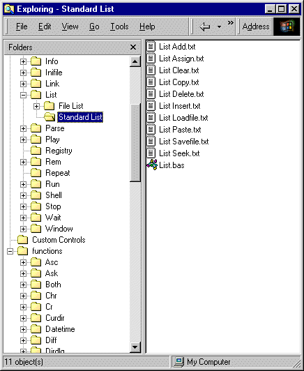



## Newbie VB Reference

### Description

NEWBIE MUST HAVE VB REFERENCE: 

I spent about a week compiling various commands and functions before I began my first project, not ALL the code is mine, but ALOT of it is. I have previous experience coding in some less popular languages, so I knew what I was looking for ;-) I personally created the three custom controls FontCombo, ColorCombo and LabeledText and some of the following are must haves: 

Directory Commands 

File Commands 

How to use Font and File Dialogs 

How to use and manipulate List 

How to Parse by delimiter 

And there is just a lot of things here, that you will either learn here, or you will HAVE TO learn somewhere else because you will need this stuff.

PLEASE VOTE FOR ME!!!
 
### More Info
 

             |
---                |---
**Submitted On**   |2002-02-01 21:14:34
**By**             |[Brandon Cunningham](https://github.com/Planet-Source-Code/PSCIndex/blob/master/ByAuthor/brandon-cunningham.md)
**Level**          |Beginner
**User Rating**    |4.4 (22 globes from 5 users)
**Compatibility**  |VB 6\.0
**Category**       |[Coding Standards](https://github.com/Planet-Source-Code/PSCIndex/blob/master/ByCategory/coding-standards__1-43.md)
**World**          |[Visual Basic](https://github.com/Planet-Source-Code/PSCIndex/blob/master/ByWorld/visual-basic.md)
**Archive File**   |[Newbie\_VB\_52352212002\.zip](https://github.com/Planet-Source-Code/brandon-cunningham-newbie-vb-reference__1-31403/archive/master.zip)

